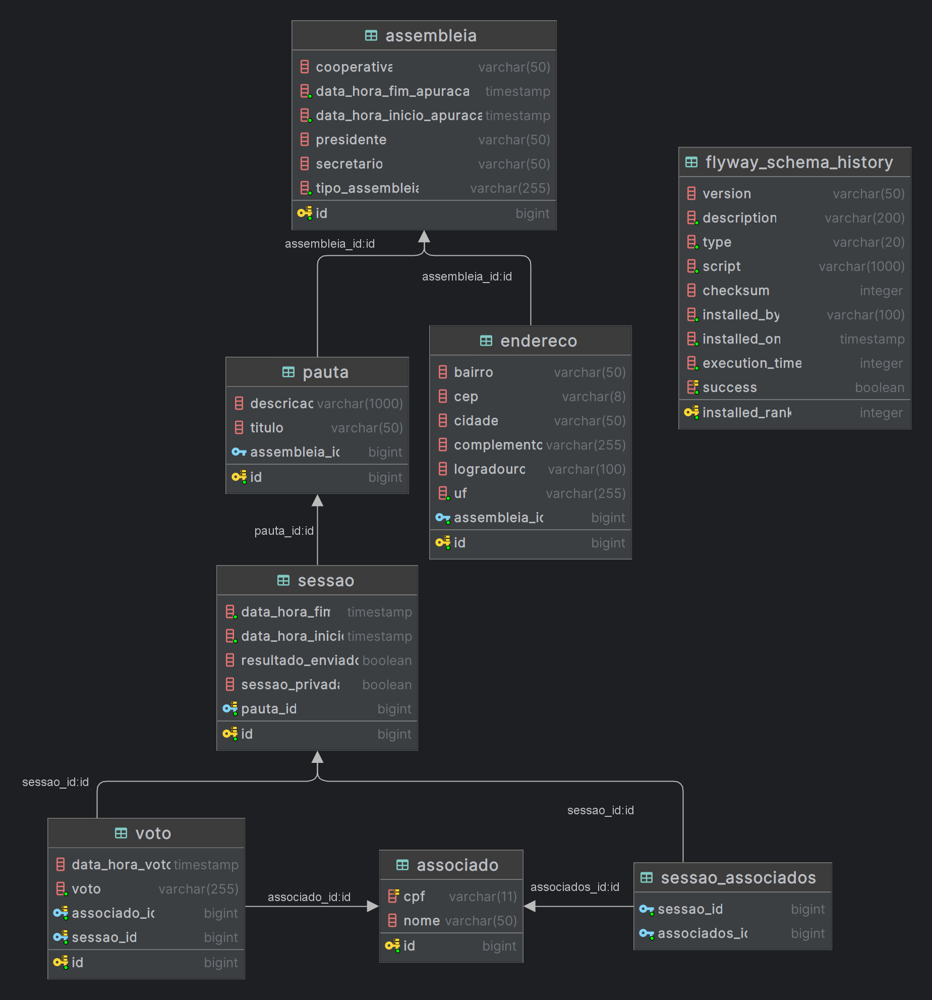

# **Desafio NTConsulting/Sicred**

## **Índice**
- [Autor](#autor)
- [Apresentação](#apresentação)
- [Arquitetura](#arquitetura)
- [Modelagem de Dados](#modelagem-de-dados)
- [Tecnologias](#tecnologias)
- [Versionamento](#versionamento)
- [Pré-requisitos](#pré-requisitos)
- [Execução](#execução)
- [Postman](#postman)
- [RabbitMQ](#rabbitmq)
- [PGAdmin](#pgadmin)
- [Swagger-UI](#swagger-ui)
- [Testes executados](#testes-executados)
- [Ideias para implementação](#ideias-para-implementação)


**Autor**
--- 
### Douglas de Sousa Santos
- [](dsousasantos91@gmail.com)
- [](https://github.com/dsousasantos91)


**Apresentação**
---

O projeto tem como objetivo atender votação de pautas de assembleias de uma Cooperativa.

As principais funcionalidades da apicação são:
- Cadastra uma nova assembleia/pauta.
- Abrir uma sessão de votação em uma pauta.
- Receber votos de associados.
- Contabilizar os votos e mostrar o resultado da votação 

Essas e outras funcionalidades podem ser vizualizadas na documentação clicando [aqui](link swagger heroku) ou acessando [http://localhost:8080](http://localhost:8080) ao executar o projeto local.


**Arquitetura**
---
A arquitetura é composta por:

- MICROSERVICE (JAVA/SPRING)
- MESSAGE BROKER (RABBITMQ)
- DATABASE (POSTGRES)

**Modelagem de Dados**
---


A ideia de ter uma tabela `assembleia` composta com uma ou muitas ``pautas`` partiu de um pré estudo realizado de como funciona votações em cooperativas.

Criar uma tabela ``endereco`` é uma opção de normalização de base que melhora a visulização dos dados de uma ``assembleia``.

A tabela ``sessao`` é uma tabela que relaciona ``pauta`` e ``voto`` já que um associado pode votar em várias pautas e as pautas podem ser votadas por vários associados.

Por fim, podemos relacionar previamente ``sessao_associados`` na abertura de uma ``sessao`` para que em casos de votações privadas possamos validar se o ``associado`` tem permissão de voto.

**Tecnologias**
---
Para implementar o projeto foram utilizadas as seguintes tecnologias:

- Java 8 (Foi implementado com a versão 17 e problemas no deploy no Heroku obrigaram a fazer downgrade)
- Spring MVC, Spring Boot, Spring Cloud, Spring Data
- SpringFox 3 (Swagger)
- JUnit 5
- Maven
- H2
- Flyway
- PostgreSQL
- RabbiMQ
- Docker
- Heroku

**Versionamento**
---
A estratégia de versionamento usadoi foi Semantic Versioning (ou SemVer) que é um sistema de numeração de versões usado para indicar mudanças no código e na funcionalidade de um programa. Estabelece um padrão claro e consistente na forma como as versões são numeradas e como as alterações em um software são comunicadas aos desenvolvedores e usuários.

O sistema de versionamento semântico é composto por três números principais, dispostos na seguinte ordem: "MAJOR.MINOR.PATCH".
- **MAJOR:** Representa versões principais do software e é incrementado quando mudanças incompatíveis com versões anteriores são feitas. Isso significa que alterações que quebram a compatibilidade com versões anteriores, como mudanças na API ou remoção de funcionalidades, levarão ao aumento do número MAJOR.
- **MINOR:** Indica a adição de novas funcionalidades ou melhorias que são compatíveis com versões anteriores. Quando um novo recurso é adicionado ao software, o número MINOR é incrementado. Geralmente, isso não causa quebras em sistemas que usam a versão anterior.
- **PATCH:** Indica correções de bugs e pequenas melhorias que não afetam a compatibilidade com versões anteriores. A cada correção de bug ou ajuste pequeno, o número PATCH é incrementado.

O projeto foi gerar com a versão 1.0.0, pois entendo que essa a entrega desse desafio representa a primeira entrega de um produto ou MVP.

**Pré-requisitos**
---
- Java 8
- Docker *(RabbiMQ e Postgres)*
- IDEs Intellij IDEA, Spring Tools Suite ou VSCode *(Opcional - apenas para alterações no código)*
- Postman *(Opcional)*

**Execução**
---
Para execurtar o projeto local é necessário o Docker e Docker-compose.

Execute o comando abaixo dentro do diretório raiz do projeto para carregar o serviço completo com `docker-compose`:

```
docker-compose up -d
```

Caso queria executar o projeto separadamente (IDE ou linha de comando) execute:

```
docker-compose -f .\docker-compose-ms-off.yml up -d
```

*Windows*
```
.\mvnw.cmd spring-boot:run
```
*Linux*
```
./mvnw spring-boot:run
```

## **Postman**

Todas as requisições estão disponíveis para execução no arquivo ```Assembleia Service.postman_collection``` basta importar no Postman.
Para executar as requisições local configure uma variável de ambiente ```url``` com o valor ```http://localhost:8080```.
Para executar as requisições em produção configure a variável com o valor ```url heroku```.

**RabbitMQ**
---
- [http://localhost:15672](http://localhost:15672)
- **User:** admin
- **Password:** admin

**Postgres**
---
- [http://localhost:5050](http://localhost:5050/)
- **User:** admin@admin.com
- **Password:** root

#### Dados para conexão:
- **User:** postgres
- **Password:** postgres

**Swagger-UI**
---
- [Local](http://localhost:8080/swagger-ui/index.html#/)
- [Produção](heroku)

## **Testes executados**

Além dos teste funcionais através da ferramenta `Postman` para garantir que os requisitos foram atendidos *(Cadastrar Assembleia/Pauta, abrir sessão, votar e contabilizar votos)* também foram realizados testes como:
- Unitário com as bibliotecas JUnit 5, Mockito e Hamcrest.
- Teste de performance com Postman:
  

**OBS.:** O arquivo com resultado dos testes funcionais estão no arquivo ``Assembleia Service.postman_test_run.json``

### Coverage

Foi gerado um relatório de cobertura de testes com uso da ferramenta de Converage interna do Intellij IDEA que pode ser vizualizado [aqui](http://localhost:63342/ms-assembleia/coverageReport/index.html?_ijt=peion68lu6b6q3l05liqhcq36f&_ij_reload=RELOAD_ON_SAVE).

## **Ideias para implementação**

- Os teste unitários das camadas de Controller foram implementados considerando apenas o cenário de ```SUCESSO```. Com maior prazo seria possível criar cenários para testar as validações de cada campo enviados no payload da requisição.
- Uma outra abordagem que ajuda a aumantar a garantia dos testes é ```test-container``` , assim garantindo o teste de integração com serviços externos (Postgres e RabbitMQ).
